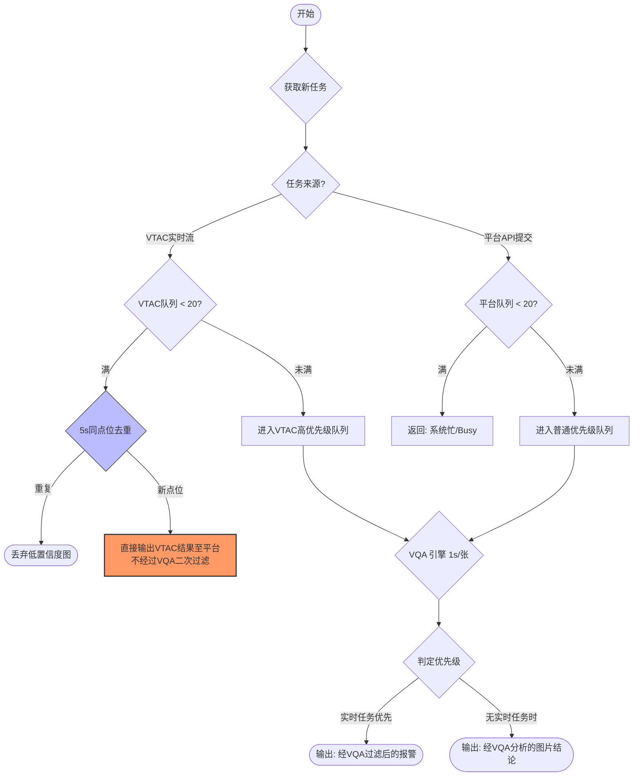

```mermaid
flowchart TD
    Start([开始]) --> GetTask{获取新任务}
    
    %% 任务分类
    GetTask --> Type{任务来源?}
    
    %% 路径1：VTAC实时路径
    Type -- VTAC实时流 --> V_Queue{VTAC队列 < 20?}
    V_Queue -- 满 --> DeDup{5s同点位去重}
    DeDup -- 重复 --> Drop1([丢弃低置信度图])
    DeDup -- 新点位 --> ForceOut[直接输出VTAC结果至平台\n不经过VQA二次过滤]
    
    V_Queue -- 未满 --> V_Execute[进入VTAC高优先级队列]
    
    %% 路径2：平台提交路径
    Type -- 平台API提交 --> P_Queue{平台队列 < 20?}
    P_Queue -- 满 --> Error[返回: 系统忙/Busy]
    P_Queue -- 未满 --> P_Execute[进入普通优先级队列]
    
    %% 执行引擎
    V_Execute --> Engine{VQA 引擎 1s/张}
    P_Execute --> Engine
    Engine --> Priority{判定优先级}
    Priority -- 实时任务优先 --> Out1([输出: 经VQA过滤后的报警])
    Priority -- 无实时任务时 --> Out2([输出: 经VQA分析的图片结论])

    style ForceOut fill:#f96,stroke:#333,stroke-width:2px
    style DeDup fill:#bbf,stroke:#333
```
